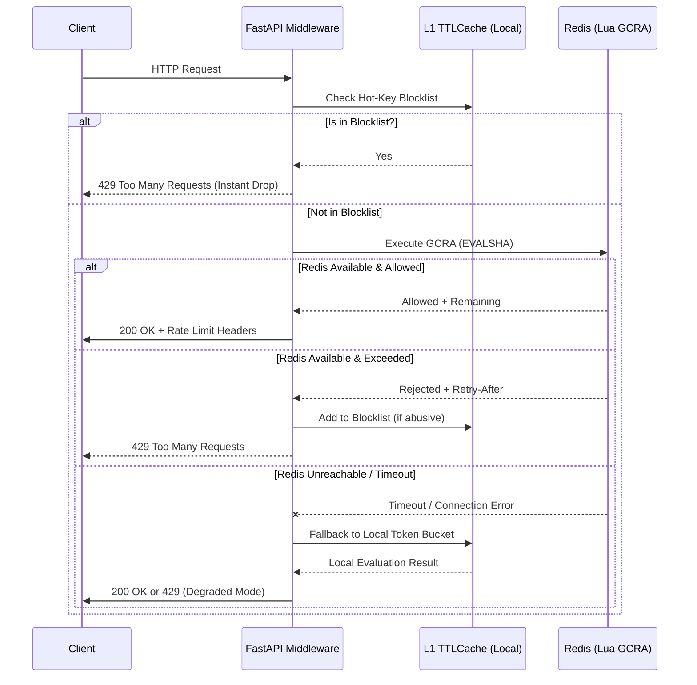
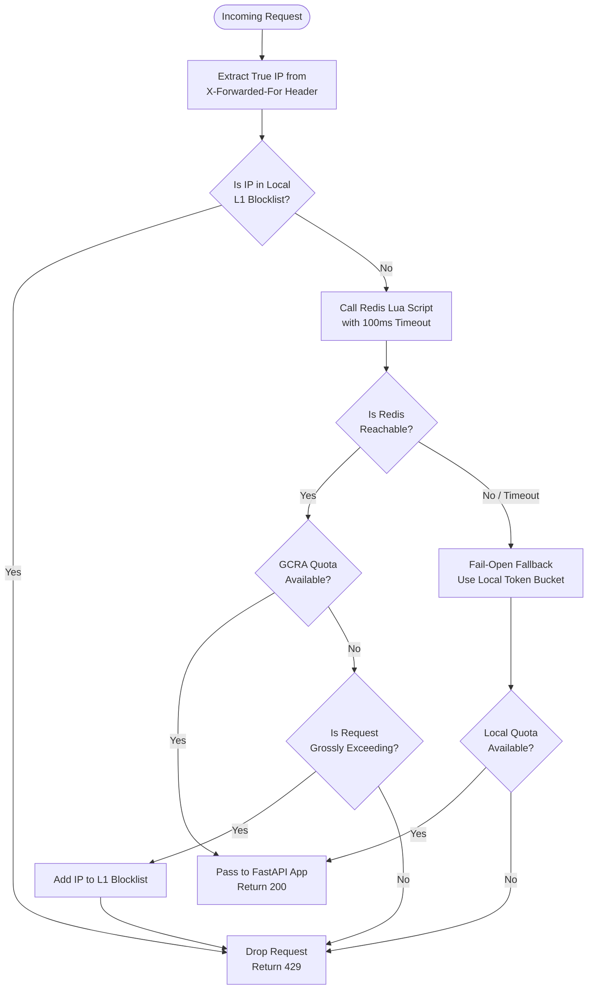

# Distributed Rate Limiting Middleware (FastAPI + Redis GCRA)

[](https://github.com/cvneren/rate-limiting-architecture/actions/workflows)
[](https://opensource.org/licenses/MIT)
[](https://www.python.org/downloads/)
[](https://redis.io/)

A high-performance, production-grade distributed rate limiting solution for FastAPI applications. This implementation leverages the **Generic Cell Rate Algorithm (GCRA)** and atomic **Redis Lua scripting** to ensure systemic stability under high concurrency.

## 1. Problem Statement

*   **Situation**: In distributed microservice architectures, API gateways are highly vulnerable to volumetric attacks, traffic spikes, and "noisy neighbor" scenarios where a single tenant consumes disproportionate resources, leading to cascading downstream failures.
*   **Task**: Architect and implement a production-grade, distributed rate-limiting middleware that provides absolute fairness and security, without introducing noticeable latency or becoming a single point of failure.
*   **Action**: Implemented the **Generic Cell Rate Algorithm (GCRA)** using atomic **Redis Lua scripting** to eliminate TOCTOU (Time-Of-Check-To-Time-Of-Use) race conditions. Engineered a **Pure ASGI Middleware** in FastAPI to minimize overhead, and introduced a two-tier resilience strategy featuring an **L1 In-Memory Hot-Key Blocklist** and a **Fail-Open Token Bucket Fallback**.
*   **Result**: A resilient, microsecond-latency control plane that seamlessly handles massive concurrency. It successfully halts abusive IPs instantly from memory, synchronizes distributed state atomically via Redis, and automatically degrades gracefully to local memory if the Redis cluster becomes unavailable—guaranteeing 100% API uptime.

## 2. Architecture & Request Flow

### Request Lifecycle (Sequence Diagram)
This diagram illustrates the multi-tier defense mechanism, highlighting how the system optimizes for speed (L1 Cache) and resilience (Fail-Open Fallback).



### Decision Logic Flowchart
This flowchart details the exact algorithmic path a request takes, demonstrating the solutions to "Noisy Neighbor" isolation and "Systemic Stability".



## 3. Core Architectural Decisions

### 3.1 Generic Cell Rate Algorithm (GCRA)
We implement the Token Bucket model via the GCRA. Unlike naive implementations that require continuous replenishment threads, GCRA tracks a single state variable per client—the **Theoretical Arrival Time (TAT)**. This reduces memory overhead to $O(1)$ per identifier and eliminates float-rounding anomalies in distributed state.

### 3.2 Atomic Concurrency Control (Lua Scripting)
To neutralize **Time-Of-Check-To-Time-Of-Use (TOCTOU)** race conditions, the entire evaluation lifecycle is offloaded to a server-side Lua script (`EVALSHA`). 
*   **Atomicity**: Evaluation and mutation occur as a single indivisible unit on the Redis event loop.
*   **Clock Synchronization**: The script utilizes `redis.call('TIME')` as the absolute chronological source of truth, defeating multi-node clock drift.
*   **Cluster Compatibility**: Implements **Hash Tags** (e.g., `{client_id}`) to ensure all state for a specific client maps to the same Redis Cluster shard, preventing `CROSSSLOT` errors.

### 3.3 Two-Tier Resilience Strategy
*   **L1 Hot-Key Protection**: A local, bounded `TTLCache` (in-memory) intercepts identified abusers. If a client is grossly exceeding quotas, the middleware blocks subsequent requests natively in Python, shielding the Redis cluster from single-core saturation.
*   **Fail-Open Resilience**: All Redis operations are wrapped in strict `asyncio.timeout` blocks. Upon network partition or Redis failure, the system falls back to a local in-process rate limiter, maintaining API availability (High Availability over Strict Consistency).

### 3.4 Pure ASGI Implementation
This middleware is implemented as a **Pure ASGI class**, bypassing Starlette’s `BaseHTTPMiddleware`. This prevents unnecessary request/response object cloning and minimizes garbage collection (GC) overhead, yielding a significant improvement in raw requests-per-second (RPS) throughput.

## 4. Local Development

### Prerequisites
*   **Python**: 3.11 or higher
*   **Redis**: 7.0 or higher (required for native `TIME` command support in Lua scripts)

### Installation
1.  **Clone the repository**:
    ```bash
    git clone https://github.com/cvneren/rate-limiting-architecture.git
    cd rate-limiting-architecture
    ```

2.  **Set up a Virtual Environment**:
    ```bash
    python3 -m venv venv
    source venv/bin/activate  # On Windows use `venv\Scripts\activate`
    ```

3.  **Install dependencies**:
    ```bash
    pip install --upgrade pip
    pip install -r requirements.txt
    ```

### Configuration
Environment variables are managed via Pydantic Settings:
*   `REDIS_URL`: Defaults to `redis://localhost:6379/0`
*   `RATE_LIMIT_LIMIT`: Allowed requests per period (default: 100)
*   `RATE_LIMIT_PERIOD`: Time window in seconds (default: 60)
*   `RATE_LIMIT_BURST`: Initial burst capacity (default: 10)

### Running the Application
```bash
uvicorn app.main:app --host 0.0.0.0 --port 8000
```

### Verification
The project includes a comprehensive concurrency test suite:
```bash
pytest tests/ -v --asyncio-mode=auto
```
This validates TOCTOU defense, fail-open fallback mechanisms, and L1 blocklist isolation.
